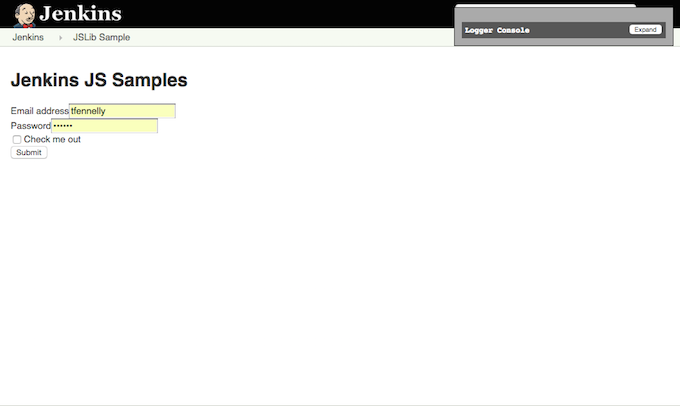

# Step 02 - Add CommonJS modules ("nodeify")
The next step is to add some [CommonJS] modules to your plugin. We use [jenkins-js-builder] and some other [Node.js]
tools to build a self contained browser-ready JavaScript "[bundle]" that can be loaded through your Jenkins `.jelly` files
(or whatever mechanism works for your plugin).

There are a few simple steps to adding [CommonJS] modules to your plugin.

<p>
<ol>
    <li><a href="#install-nodejs-and-gulp">Install Node.js and Gulp</a><br/>
    <li><a href="#add-packagejson">Add `package.json`</a><br/>
    <li><a href="#add-initial-npm-packages">Add initial NPM packages</a><br/>
    <li><a href="#add-first-commonjs-module">Add first CommonJS module</a><br/>
    <li><a href="#add-gulpfilejs">Add `gulpfile.js`</a><br/>
    <li><a href="#build-the-javascript-bundle-for-the-browser">Build the JavaScript bundle for the Browser</a><br/>
    <li><a href="#add-the-javascript-bundle-to-the-jelly-page">Add the JavaScript bundle to the .jelly page</a><br/>
    <li><a href="#test-run">Test run</a><br/>
    <li><a href="#integrate-gulp-and-maven-builds">Integrate Gulp and Maven builds</a><br/>
</ol>    
</p>
 
## Install Node.js and Gulp 
On your dev machine, install [Node.js] v4.0.0+.

You'll also need to globally install [Gulp].
  
```sh
$ npm install --global gulp
```

> __NOTE__ that [Node.js] and [Gulp] only needs to be installed on Dev machines so as to allow the running of node/npm/gulp etc commands while developing the plugin. A simple check out and build of your plugin (using maven) will NOT require [Node.js] to be installed on the build machine. The maven build will take care of everything.

## Add `package.json`
Add a `package.json` file to the root of your plugin using the [`npm init`](https://docs.npmjs.com/cli/init) command.

```sh
$ npm init
This utility will walk you through creating a package.json file.
It only covers the most common items, and tries to guess sensible defaults.

See 'npm help json' for definitive documentation on these fields
and exactly what they do.

Use 'npm install <pkg> --save' afterwards to install a package and
save it as a dependency in the package.json file.

Press ^C at any time to quit.
name: (step-02-nodeify)
```

## Add initial NPM packages
Install the minimum set of NPM packages required for your plugin to build ([gulp](https://github.com/gulpjs/gulp) and [jenkins-js-builder]).

```sh
$ npm install --save-dev gulp jenkins-js-builder
```

Let's also install the [jquery-detached] package.

```sh
$ npm install --save jquery-detached
```

## Add first CommonJS module
Create `src/main/js/jslib-samples.js` and add the following JavaScript code:

```javascript
var $ = require('jquery-detached').getJQuery();

$(document).ready(function () {    
    $('#side-panel').remove();
    $('#main-panel').css('margin-left', '0px');
});
```

This silly little [CommonJS] module will just use jQuery (via [jquery-detached]) to remove the left side-panel. Of
course we could add more [CommonJS] modules in `src/main/js` and use them in our App.

## Add `gulpfile.js`
Add a `gulpfile.js` file to the root of your plugin.

`gulpfile.js` will not contain a lot of code. Most of the work is done by [jenkins-js-builder]. 

```javascript
var builder = require('jenkins-js-builder');

//
// Bundle the modules.
// See https://github.com/jenkinsci/js-builder
//
builder.bundle('src/main/js/jslib-samples.js')
       .inDir('src/main/webapp/jsbundles');
```

The `builder.bundle` command is asking [jenkins-js-builder] to create a [bundle] (using [Browserify]) starting from
`src/main/js/jslib-samples.js`, and to output the generated [bundle] file in `src/main/webapp/jsbundles`. The
generated [bundle] file will be totally self contained (containing a private copy of jQuery and anything else used by
the App) and loadable in a browser.
 
## Build the JavaScript bundle for the Browser
To build the [bundle], simple run:

```sh
$ gulp
```

You should see output like the following:

```sh
$ gulp
[12:05:56] Maven project
[12:05:56]  - src: src/main/js,src/main/less
[12:05:56]  - test: src/test/js
[12:05:56] Setting defaults
[12:05:56] Bundle will be generated in directory 'src/main/webapp/jsbundles' as 'jslib-samples.js'.
[12:05:56] Using gulpfile ~/projects/jenkins-plugins/jenkins-js-samples/step-02-nodeify/gulpfile.js
[12:05:56] Starting 'jshint'...
[12:05:56] 	- Using default JSHint configuration (in jenkins-js-builder). Override by defining a .jshintrc in this folder.
[12:05:56] Finished 'jshint' after 236 ms
[12:05:56] Starting 'bundle'...
[12:05:56] Finished 'bundle' after 91 ms
[12:05:56] Starting 'appTest'...
[12:05:56] Testing web server started on port 18999 (http://localhost:18999). Content root: /Users/tfennelly/projects/jenkins-plugins/jenkins-js-samples/step-02-nodeify
[12:05:56] Finished 'appTest' after 36 ms
[12:05:56] Starting 'test'...
[12:05:56] Finished 'test' after 7.39 μs
[12:05:56] Starting 'default'...
[12:05:56] Finished 'default' after 7.79 μs
SUCCESS: 0 specs, 0 failures, 0 skipped, 0 disabled in 0s.
[12:05:56] Testing web server stopped.
```

As you can see from the log, the [bundle] will be generated in directory `src/main/webapp/jsbundles` as `jslib-samples.js`.
This will put the [bundle] into the plugin's webapp dir under `jsbundles`, making it loadable on the plugin path
at runtime via `plugin/<plugin-name>/jsbundles/jslib-samples.js`. Of course could could also use
a Stapler adjunct, but that's a bit funky if not needed.

## Add the JavaScript bundle to the .jelly page
Using the information from the previous section, it's easy to determine how to load the [bundle] in Jenkins via the
`.jelly` file. In this example we just use regular `<script>` tags, adding them to
[JSLibSample/index.jelly](src/main/resources/org/jenkinsci/ui/samples/JSLibSample/index.jelly).

```html
<script src="../plugin/step-02-nodeify/jsbundles/jslib-samples.js" type="text/javascript"></script>
```

## Test run
At this stage, you should be able to take `step-02-nodeify` for a test run and see how the Modularized JavaScript
behaves. You can do this by simply [running the plugin using the HPI plugin](https://wiki.jenkins-ci.org/display/JENKINS/Plugin+tutorial#Plugintutorial-DebuggingaPlugin).



As you can see, the [bundle] ran fine and used jQuery (contained in the [bundle]) to remove the left side-panel.

## Integrate Gulp and Maven builds
You will want to run the `gulp` build (to generate the [bundle]) as part of your plugin's Maven build. For that reason, 
the `gulp` build needs to be integrated into the `mvn` build lifecycle.

If your plugin's parent POM is `org.jenkins-ci.plugins:plugins:1.639` or newer, no action is required. If your
plugin depends on an older parent POM, then you will need to add the maven `<profile>`s referred to in the
[sample_extract_pom.xml](https://github.com/jenkinsci/js-builder/blob/master/res/sample_extract_pom.xml) in
[Maven Integration](https://github.com/jenkinsci/js-builder#maven-integration) section of the [jenkins-js-builder] docs.

<hr/>
<b><a href="../../../tree/master/step-01-basic">&lt;&lt; PREV (step-01-basic) &lt;&lt;</a>  |||  <a href="../../../tree/master/step-03-bootstrap">&gt;&gt; NEXT (step-03-bootstrap) &gt;&gt;</a></b>

[Node.js]: https://nodejs.org
[Gulp]: https://github.com/gulpjs/gulp
[jenkins-js-builder]: https://github.com/jenkinsci/js-builder
[jenkins-js-modules]: https://github.com/jenkinsci/js-modules
[CommonJS]: http://www.commonjs.org/
[jquery-detached]: https://github.com/tfennelly/jquery-detached
[Browserify]: http://browserify.org/
[bundle]: https://github.com/jenkinsci/js-modules/blob/master/FAQs.md#what-is-the-difference-between-a-module-and-a-bundle
