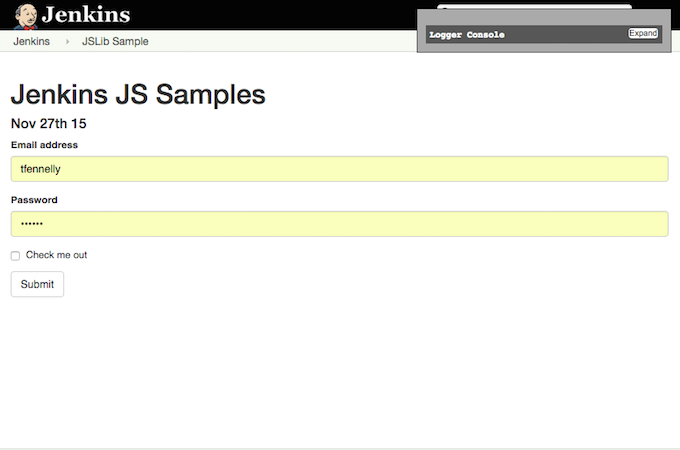

# Step 03 - Use more NPM packages i.e. Twitter Bootstrap and Moment.js - How it works
`step-03-more-npm-packs` builds on <a href="../../../tree/master/step-02-nodeify">step-02-nodeify</a>, adding a few more
NPM packages to the mix, namely Twitter Bootstrap (via [bootstrap-detached])
and Moment.js. This is one of the major benefits of using [CommonJS] style packages; it means we can easily utilise
the huge number of JavaScript packages available in the NPM registry.

## Install/Uninstall NPM packages
Install [bootstrap-detached] and Moment.js:

```sh
$ npm install --save bootstrap-detached moment
```

Since we are using [bootstrap-detached], we can uninstall jquery because [bootstrap-detached]
is `jquery + bootstrap`:

```sh
$ npm uninstall --save jquery
```

> Note: [bootstrap-detached] is easier to use because it contains it's own "detached" instance of jquery ([jquery-detached]). 

## Update `.js`
The changes to the `src/main/js/jslib-samples.js` are very trivial.
 
```diff
-var $ = require('jquery');
+// Change from 'jquery' to 'bootstrap-detached' 
+var $ = require('bootstrap-detached').getBootstrap();
 
 $(document).ready(function () {    
     $('#side-panel').remove();
     $('#main-panel').css('margin-left', '0px');
+    
+    // Add some code to use momentjs, adding formatted time text to the page.
+    // See src/main/resources/org/jenkinsci/ui/samples/JSLibSample/index.jelly.
+    var moment = require('moment');
+    $('#main-panel .time').text(moment().format("MMM Do YY"));
 });
```

## Bundle Bootstrap CSS

The fact that we're using Bootstrap means that we need to add bootstrap's CSS to the plugin. After [downloading the
bootstrap distro](http://getbootstrap.com/getting-started/), the CSS was added in
[src/main/css/bootstrap336](src/main/css/bootstrap336). We want to bundle this CSS (and all related 
resources - fonts etc) in our plugin and to do that, we simply add another `bundle`
command to the [gulpfile.js](gulpfile.js) as follows:

```javascript
builder.bundle('src/main/css/bootstrap336/bootstrap.css');
```

This bundling command will bundle everything under `src/main/css/bootstrap336` into the plugin as adjuncts. The
adjunct identifier is output to the console by the build (just as described with the `.js` bundle adjunct
in <a href="../../../tree/master/step-02-nodeify">step-02-nodeify</a>).

```sh
[12:33:57] CSS resource "src/main/css/bootstrap336/bootstrap.css" will be available
           in Jenkins as adjunct "org.jenkins.ui.jsmodules.bootstrap336.bootstrap".
```

> Note: You can also specify a [LESS](http://lesscss.org/) file here and it will be pre-processed and bundled into the Jenkins plugin.

The changes to [JSLibSample/index.jelly](src/main/resources/org/jenkinsci/ui/samples/JSLibSample/index.jelly) were trivial
i.e. just add the adjunct:

```html
<st:adjunct includes="org.jenkins.ui.jsmodules.bootstrap336.bootstrap"/>
```

> Note: Of course you can also just place the CSS resources somewhere in `src/main/resources` and they will get bundled
> in the plugin classpath. The benefit of doing it as outlined above is that it makes dealing with [LESS] a bit easier.
> It also auto-adds `.adjunct` marker files to all the resource sub-directories, making it possible to load fonts etc as adjuncts.

## Test run
Now take `step-03-more-npm-packs` for a test run and see the effect of these changes. 
Again, you can do this by simply [running the plugin using the HPI plugin](https://wiki.jenkins-ci.org/display/JENKINS/Plugin+tutorial#Plugintutorial-DebuggingaPlugin).



<hr/>
<p align="center">
<b><a href="../../../tree/master/step-02-nodeify">&lt;&lt; PREV (step-02-nodeify) &lt;&lt;</a>  &nbsp;&nbsp;&nbsp;&nbsp;&nbsp;&nbsp;&nbsp;&nbsp;&nbsp;&nbsp;&nbsp;  <a href="../../../tree/master/step-04-externalize-libs">&gt;&gt; NEXT (04-externalize-libs) &gt;&gt;</a></b>
</p>

[Node.js]: https://nodejs.org
[Gulp]: https://github.com/gulpjs/gulp
[jenkins-js-builder]: https://github.com/jenkinsci/js-builder
[jenkins-js-modules]: https://github.com/jenkinsci/js-modules
[CommonJS]: http://www.commonjs.org/
[jquery-detached]: https://github.com/tfennelly/jquery-detached
[bootstrap-detached]: https://github.com/tfennelly/bootstrap-detached
[Browserify]: http://browserify.org/
[bundle]: https://github.com/jenkinsci/js-modules/blob/master/FAQs.md#what-is-the-difference-between-a-module-and-a-bundle

