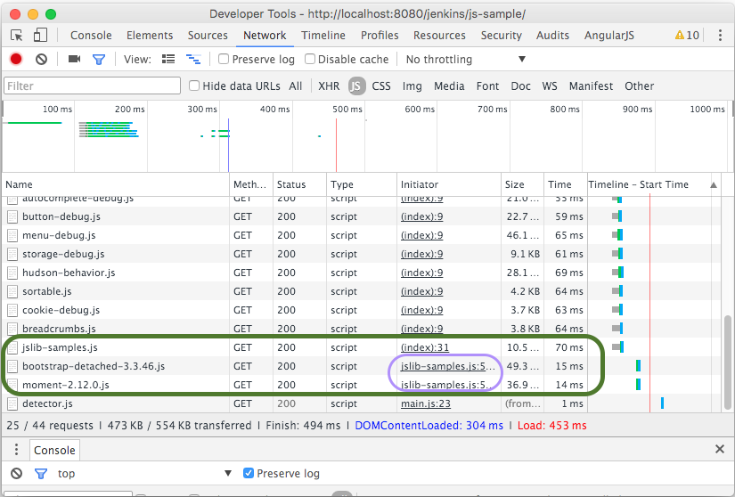

# Step 04 - Externalize Dependency Libraries (slim down) - How it Works
With `step-03-more-npm-packs`, we have a plugin using Modularized [CommonJS] style JavaScript, which is good. Using
[CommonJS] means we can easily use any of the huge number of JavaScript packages available in the NPM registry.

This is great, but one of the issues with `step-03-more-npm-packs` is that its [bundle] contains everything it needs,
including jQuery, Bootstrap, Moment.js and anything else we might add. This results in a quite bloated `.js` [bundle]
for `step-03-more-npm-packs` - roughly 100Kb. If a given Jenkins page loads multiple `.js` bundles like this, it will
potentially result in multiple jQuery instances (and Bootstrap, Moment.js etc) being loaded. What we really want in
this kind of situations is to have slimmer/lighter "App" bundles, all sharing the same jQuery etc.

In `step-04-externalize-libs`, we build on top of <a href="../../../tree/master/step-03-more-npm-packs">step-03-more-npm-packs</a>,
changing the bundling process by telling [jenkins-js-builder] to "externalize" some of the NPM dependencies. This means
that `step-04-externalize-libs`s `.js` [bundle] will no longer include these dependencies and it's size will reduce to
~10Kb gzipped (as opposed to ~100Kb). Note that this change should not require app `.js`
code changes. The only change is in the `package.json`.

## Configure Node build to externalize dependencies
Externalizing NPM dependencies is a simple process. Just add an `extDependencies` entry in the `package.json`.
In the case of this plugin externalizing [bootstrap-detached] and Moment.js:

```javascript
  "jenkinscd" : {
    "extDependencies": ["bootstrap-detached", "moment"]
  }
```

The above instruction tells [jenkins-js-builder] to create seperate adjunct based bundles for these dependencies
and to add them to the plugin archive. [jenkins-js-builder] does some magic (with [jenkins-js-modules]) that results in
these dependency bundles being created in a way that if (e.g.) another plugin has also externalized the same dependency
(version compatibility info below) then it will only be loaded once at runtime e.g. if a "compatible" version of the
same NPM dependency was already loaded by [jenkins-js-modules] then it will not be loaded again.

An important aspect of this externalization of NPM dependencies is the rules around how version compatibility works.
In this regard, the above mentioned [jenkins-js-builder]/[jenkins-js-modules] magic honours the semantic versioning
rules i.e. if a dependency bundle for Moment.js version `2.12.0` is already loaded, [jenkins-js-modules] will
serve that version to anything that has a `moment` NPM dependency specification of version `^2.12.x` or `^2.x` i.e.
they are considered as being compatible. If a compatible version of `moment` has not yet been loaded,
[jenkins-js-modules] will trigger the async loading of that adjunct bundle.
 
So putting it another way, every plugin will have `.js` bundle adjuncts for all of their external dependencies.
If JavaScript for plugin "A" requires an externalized dependency to be loaded (e.g. `moment` v2.12.0),
[jenkins-js-modules] will load that dependency for plugin "A".  If plugin "B" then (some time later) also needs `moment`
and it's version dependency is compatible with the already loaded version (e.g. `^2.x`), then [jenkins-js-modules]
will not trigger another loading of of `moment` i.e. it will provide the already loaded `moment` to plugin "B".

## Test run
Now take `step-04-externalize-libs` for a test run and see the effect of these changes. What you'll see is that
nothing has changed visually i.e. still works the same from a user perspective. The difference is in HOW it works.

The `jslib-samples.js` [bundle] no longer contains [bootstrap-detached] or Moment.js.
 
The easiest way to see this is through the Browsers Developer Tools.
 


<hr/>
<p align="center">
<b><a href="../../../tree/master/step-03-more-npm-packs">&lt;&lt; PREV (step-03-more-npm-packs) &lt;&lt;</a>  &nbsp;&nbsp;&nbsp;&nbsp;&nbsp;&nbsp;&nbsp;&nbsp;&nbsp;&nbsp;&nbsp;  <a href="../../../tree/master/step-05-namespaced-css">&gt;&gt; NEXT (step-05-namespaced-css) &gt;&gt;</a></b>
</p>

[Node.js]: https://nodejs.org
[Gulp]: https://github.com/gulpjs/gulp
[jenkins-js-builder]: https://github.com/jenkinsci/js-builder
[jenkins-js-modules]: https://github.com/jenkinsci/js-modules
[jenkins-js-libs]: https://github.com/jenkinsci/js-libs
[CommonJS]: http://www.commonjs.org/
[jquery-detached]: https://github.com/tfennelly/jquery-detached
[bootstrap-detached]: https://github.com/tfennelly/bootstrap-detached
[Browserify]: http://browserify.org/
[bundle]: https://github.com/jenkinsci/js-modules/blob/master/FAQs.md#what-is-the-difference-between-a-module-and-a-bundle

