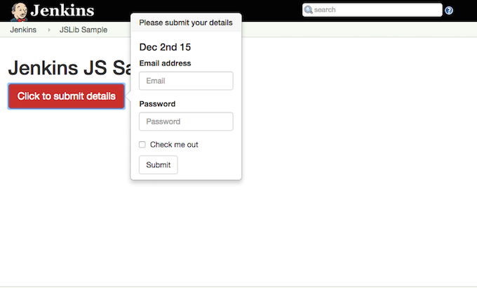

# Step 08 - Zombie tests
[Zombie] is an "Insanely fast, full-stack, headless browser testing using node.js", making it useful
for integration testing.
  
In this sample plugin, we modified <a href="../../../tree/master/step-06-handlebars-templates">step-06-handlebars-templates</a>
a little so as the make it a small bit more interactive. We then added a simple integration test using [Zombie]. 

> Also see <a href="../../../tree/master/step-07-jsdom-tests">step-07-jsdom-tests</a> as an example of how to do Unit Testing. 

## How to run
The easiest way to run this Jenkins plugin is to [use the standard Maven HPI plugin for Jenkins](https://wiki.jenkins-ci.org/display/JENKINS/Plugin+tutorial#Plugintutorial-DebuggingaPlugin).

```sh
$ mvn hpi:run
```

After running the plugin you'll see that the form (that was in <a href="../../../tree/master/step-06-handlebars-templates">step-06-handlebars-templates</a>)
has now moved into a Twitter Bootstrap popover.



## The test
In this plugin, we want to add a JavaScript unit test to test this page i.e.:

1. That the big red button is displayed
1. That the popover form appears when we click on that button
1. That the popover form disappears when we click the form "Submit" button
 
To install `zombie`:
 
```sh
$ npm install --save-dev zombie
```

Since this is a maven project, [jenkins-js-builder] looks for the tests in `src/test/js` so that is where we
added the test "spec" file i.e. `src/test/js/jslib-samples-spec.js`. [jenkins-js-builder] uses [Jasmine] to
run all tests ("**/*-spec.js") it finds under the `src/test/js` sub directory.
 
[See the test code in jslib-samples-spec.js and read the comments therein](src/test/js/jslib-samples-spec.js).
 
## Running the test 
Running the tests from the commandline is easy. Just run `gulp` and that will run the tests too:

```sh
$ gulp
```

> The `gulp` process also runs as part of the `mvn` build, generating the JavaScript bundle(s) into the generated HPI artifact.

Running `gulp` should produce an output something like the following:

```sh
$ gulp
[13:57:00] Maven project
[13:57:00]  - src: src/main/js,src/main/less
[13:57:00]  - test: src/test/js
[13:57:00] Setting defaults
[13:57:00] Bundle will be generated in directory 'src/main/webapp/jsbundles' as 'jslib-samples.js'.
[13:57:00] Using gulpfile ~/projects/jenkins-plugins/jenkins-js-samples/step-08-zombie-tests/gulpfile.js
[13:57:00] Starting 'jshint'...
[13:57:00] 	- Using default JSHint configuration (in jenkins-js-builder). Override by defining a .jshintrc in this folder.
[13:57:00] Finished 'jshint' after 169 ms
[13:57:00] Starting 'bundle_jslib-samples'...
[13:57:00] Starting 'bundle_jslib-samples_no_imports'...
[13:57:01] Finished 'bundle_jslib-samples' after 1.19 s
[13:57:01] Finished 'bundle_jslib-samples_no_imports' after 1.11 s
[13:57:01] Starting 'bundle'...
[13:57:01] Finished 'bundle' after 7.94 μs
[13:57:01] Starting 'test'...
[13:57:01] Testing web server started on port 18999 (http://localhost:18999). Content root: /Users/tfennelly/projects/jenkins-plugins/jenkins-js-samples/step-08-zombie-tests
[13:57:01] Test execution completed.
[13:57:01] Finished 'test' after 61 ms
[13:57:01] Starting 'default'...
[13:57:01] Finished 'default' after 7.36 μs
step 08 - zombie headless browser test
  - basic test ...
  zombie Opened window http://localhost:18999/src/test/js/testpage.html  +0ms
  zombie GET http://localhost:18999/src/test/js/testpage.html => 200 +34ms
  zombie Loaded document http://localhost:18999/src/test/js/testpage.html +24ms
  zombie GET http://localhost:18999/src/main/webapp/jsbundles/no_imports/jslib-samples.js => 200 +11ms
  zombie Event loop is empty +100ms
  zombie Event loop is empty +33ms
  zombie Event loop is empty +6ms
 Passed
1 of 1 passed (0 skipped, 0 disabled).
SUCCESS: 1 spec, 0 failures, 0 skipped, 0 disabled in 0.25s.
[13:57:02] Testing web server stopped.
```

## So what happened?
The test relies on the fact that [jenkins-js-builder] automatically runs a test web server on port `18999`, with its
content root being the `cwd` of the build run i.e. the root of the maven project. See the console output above i.e.

```sh
[13:57:01] Testing web server started on port 18999 (http://localhost:18999). Content root: /Users/tfennelly/projects/jenkins-plugins/jenkins-js-samples/step-08-zombie-tests
```

The test spec file ([jslib-samples-spec.js](src/test/js/jslib-samples-spec.js)) uses this and [Zombie] to load a test HTML
page ([testpage.html](src/test/js/testpage.html)). This test page contains the same `<button>` element that the app bundle
acts on. It also contains a `<script>` element for loading the "no_imports" version of the bundle (see below).
[jslib-samples-spec.js](src/test/js/jslib-samples-spec.js) creates a [Zombie] browser and uses it to navigate this page,
clicking on buttons and making assertions.

As stated above, [testpage.html](src/test/js/testpage.html) contains a `<script>` element for loading the "no_imports"
version of the bundle. We generate this version of the bundle via the `gulpfile.js` simply because it makes this type
of testing a bit easier because it means we don't have to resolve `imports` etc. Generating the "no_imports" version of
the bundle requires the following change to the `gulpfile.js`:

```diff
 var builder = require('jenkins-js-builder');
 
 //
 // Bundle the modules.
 // See https://github.com/jenkinsci/js-builder
 //
 builder.bundle('src/main/js/jslib-samples.js')    
        .withExternalModuleMapping('bootstrap-detached', 'bootstrap:bootstrap3')
        .withExternalModuleMapping('moment', 'momentjs:momentjs2')
        .withExternalModuleMapping('handlebars', 'handlebars:handlebars3')
-       .inDir('src/main/webapp/jsbundles');
+       .inDir('src/main/webapp/jsbundles')
+       .generateNoImportsBundle();
```

> <a href="https://github.com/jenkinsci/js-builder#step-41-optional-generating-a-no_imports-bundle">More on generating "no_import" bundles</a>. 

<hr/>
<p align="center">
<b><a href="../../../tree/master/step-07-jsdom-tests">&lt;&lt; PREV (step-07-jsdom-tests) &lt;&lt;</a></b>
</p>

[Zombie]: http://zombie.js.org/
[jenkins-js-test]: https://github.com/jenkinsci/js-test
[jenkins-js-builder]: https://github.com/jenkinsci/js-builder
[Jasmine]: http://jasmine.github.io/

